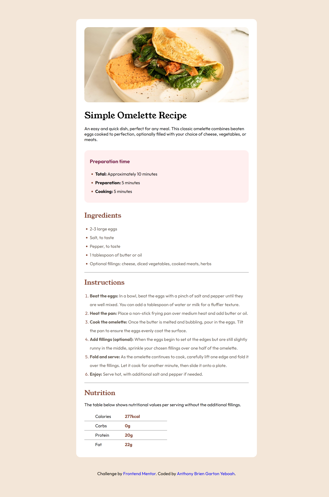

# Initial-recipe-page-website
# Frontend Mentor - Recipe page solution

This is a solution to the [Recipe page challenge on Frontend Mentor](https://www.frontendmentor.io/challenges/recipe-page-KiTsR8QQKm). Frontend Mentor challenges help you improve your coding skills by building realistic projects. 

## Table of contents

- [Overview](#overview)
  - [Screenshot](#screenshot)
  - [Links](#links)
- [My process](#my-process)
  - [Built with](#built-with)
  - [What I learned](#what-i-learned)
  - [Continued development](#continued-development)
- [Author](#author)
- [Acknowledgments](#acknowledgments)

## Overview

### Screenshot




### Links

- Solution URL:(https://frontendmentor.io)(https://github.com)

## My process

### Built with

- HTML5 
- CSS 3
- Visual Studio Code


### What I learned

```css
li::marker {
  color: hsl(14, 45%, 36%);
}
table{
  border-collapse: collapse;
  text-align:left;
}
.hyperlinks{
  text-decoration: none;
}
.hyperlinks:hover{
  color:hsl(14, 45%, 36%);
}
```

### Continued development

-Adding a toggle screen for light and dark themes.
-Adding a button to change body background color for every reload of website.


## Author

- Website - [Anthony Brien Garton Yeboah](https://www.your-site.com)
- Frontend Mentor - [@garton100](https://www.frontendmentor.io/profile/garton100)


## Acknowledgments
I'm grateful to Angela Yu from @The Apprewery Brewery for her comprehensive and detailed bootcamp on HTML 5 and CSS 3. Without the comprehensive understanding I got from her course, this project would not have been a walk in the park.

